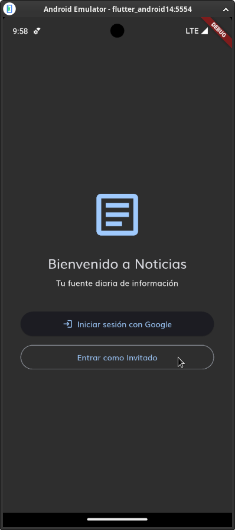
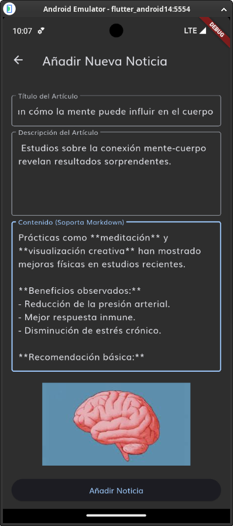

# Informe Técnico – Aplicación de Noticias para Symmetry

---

## 1. Introducción

Al recibir la tarea de desarrollar la aplicación de noticias para Symmetry, sentí emoción y a la vez un poco de incertidumbre. Mi experiencia previa estaba centrada principalmente en desarrollo backend con Python, especialmente con Django y APIs REST, por lo que enfrentarme al desarrollo móvil con Flutter y la integración con un backend basado en Firebase representaba un reto importante. Sin embargo, vi esta oportunidad como un espacio para ampliar mis conocimientos y demostrar mi capacidad de adaptación como desarrollador. Mis expectativas iniciales eran lograr una aplicación móvil funcional con operaciones CRUD básicas sobre artículos y una experiencia de usuario fluida.

---

## 2. Learning Journey (Proceso de Aprendizaje)

Antes de este proyecto, mi trabajo se limitaba mayormente a entornos backend tradicionales con Python. No tenía experiencia previa en Flutter ni en el ecosistema Firebase, por lo que tuve que aprender:

* **Reglas de Seguridad en Firebase**: Aprendí la sintaxis y lógica de las Firebase Security Rules para proteger los datos, considerando el estado de autenticación y los permisos, que difiere mucho del control de seguridad a nivel servidor que yo conocía.
* **Desarrollo con Flutter y Dart**: Aprendí sobre el sistema de widgets reactivos, gestión de estado con BLoC, diseño responsivo, y la integración con Firebase mediante FlutterFire.
* **Configuración del Entorno Móvil**: Configurar Android Studio, entender comandos de Flutter, y manejar la arquitectura general del proyecto fue desafiante al principio.

Para esto, me apoyé en:

* Documentación oficial de Flutter y Firebase
* Tutoriales y guías de Clean Architecture para Flutter
* Recursos de Android Studio
* Inteligencia Artificial para resolver dudas puntuales

Además, implementé la arquitectura limpia con capas bien definidas (presentación, dominio, datos), lo que permitió un código organizado y mantenible.

---

## 3. Challenges Faced (Retos Enfrentados)

Durante el desarrollo enfrenté varios desafíos:

* **Aprender Flutter y Dart desde cero**, especialmente acostumbrarme a su enfoque declarativo y reactivo.
* **Comprender la diferencia entre usar bibliotecas específicas de FlutterFire y las llamadas HTTP manuales** que había usado en el backend tradicional.
* **Persistencia local con Floor (SQLite)** y manejo de migraciones para funcionalidad offline.
* **Gestión del estado con BLoC**, que implicó trabajo con streams, eventos y estados.

Un reto importante fue implementar las reglas de seguridad y permisos: el sistema distingue entre usuarios autenticados y visitantes. Los visitantes (usuarios invitados) pueden ver los artículos, pero no crear ni modificar. Los usuarios autenticados pueden además crear artículos, los cuales quedan vinculados a su usuario como autor. Esto ya está implementado en las reglas de seguridad y en la lógica de la app.

---

## 4. Reflection and Future Directions (Reflexión y Futuro)

Este proyecto me permitió expandir mis habilidades hacia el desarrollo móvil y backend en un entorno serverless con Firebase. Aprendí sobre seguridad basada en reglas, arquitectura limpia en Flutter y aplicaciones offline-first. El uso de BLoC me ayudó a adoptar un patrón estructurado para manejar la UI reactiva.

Para el futuro, me planteo:

* Añadir pruebas unitarias e integrales para asegurar la calidad.
* Implementar notificaciones push con Firebase Cloud Messaging.
* Mejorar la UI/UX con animaciones y un diseño más pulido.
* Incorporar soporte multilenguaje para internacionalización.
* Seguir ampliando la funcionalidad de roles y permisos para gestión de usuarios más avanzada.

---

## 5. Proof of the Project (Evidencia del Proyecto)

### Screenshots

1. **Pantalla de Bienvenida e Inicio de Sesión**: Esta interfaz muestra la página inicial de la app "Noticias", con un logo de noticias, el texto "Bienvenido a Noticias" y "Tu fuente diaria de información", junto con opciones para "Iniciar sesión con Google" o "Entrar como invitado".

   

2. **Selección de Cuenta de Google**: Aquí se presenta una ventana emergente para elegir una cuenta de Google para continuar con la app "news_app_clean_architecture", mostrando una cuenta de ejemplo (cheviotin200@gmail.com) y la opción para agregar otra cuenta, con información sobre el intercambio de datos como nombre, email y foto de perfil.

   

3. **Pantalla Principal de Noticias con Búsqueda**: Interfaz principal titulada "Noticias Diarias" con una barra de búsqueda "Buscar por título" (con "bit" escrito), mostrando una tarjeta de noticia sobre Bitcoin superando los $100,000, con imagen de Trump y Bitcoin, y un botón "+" en la parte inferior.

   

4. **Pantalla Principal de Noticias Vacía**: Interfaz titulada "Noticias Diarias" con una barra de búsqueda "Buscar por título" vacía, mostrando seis placeholders grises donde normalmente aparecerían las tarjetas de noticias, y un botón "+" en la parte inferior, indicando que no hay contenido cargado actualmente.

   

5. **Menú Desplegable de Filtros de Tiempo**: Similar a la pantalla principal, pero con un menú desplegado sobre la barra de búsqueda, ofreciendo opciones como "Todos", "Últimas 24 horas", "Últimos 7 días" y "Último mes", junto con tarjetas de noticias visibles, incluyendo una sobre psilocibina.

   

6. **Pantalla de Artículos Guardados**: Titulada "Artículos Guardados", muestra una lista de artículos favoritos con una tarjeta sobre "La psilocibina muestra potencial...", con opción para eliminar (X) y un mensaje en la parte inferior "Artículo guardado en favoritos".

   

7. **Pantalla Principal con Menú de Sesión**: Interfaz principal con el menú superior desplegado mostrando "Iniciar Sesión", junto con las tarjetas de noticias habituales y el botón "+".

   

8. **Formulario para Añadir Nueva Noticia**: Pantalla "Añadir Nueva Noticia" con campos para "Título del Artículo", "Descripción del Artículo" y "Contenido (Soporta Markdown)", incluyendo ejemplos de beneficios observados y una imagen de un cerebro, con botón "Añadir Noticia" al final.

   

9. **Pantalla de Añadir Nueva Noticia con Error**: Esta interfaz muestra la pantalla "Añadir Nueva Noticia" con campos vacíos para "Título del Artículo", "Descripción del Artículo" y "Contenido (Soporta Markdown)", junto con un mensaje de error en rojo "El título, la descripción y la imagen no pueden estar vacíos". También incluye una sección "Toca para seleccionar una imagen" con un ícono de imagen.

   

10. **Pantalla Principal con Notificación de Artículo Añadido**: Interfaz principal mostrando tarjetas de noticias (Bitcoin, científicos exploran mente-cuerpo, psilocibina, nueva terapia), con un mensaje toast en la parte inferior "Artículo añadido con éxito!" y un ícono de carga en una tarjeta.

    

11. **Pantalla Visualizacion de article**: Muestra un único artículo con su contenido completo (por ejemplo: Bitcoin,) con una tabla y contenido markdown. 

    

12. **Ventana Emergente de Cerrar Sesión**: En la pantalla principal de noticias, aparece un popup "Cerrar Sesión" preguntando "¿Estás seguro de que quieres cerrar sesión?", con opciones "Cancelar" y "Cerrar Sesión", mientras se ven tarjetas de noticias de fondo.

    

---

## 6. Overdelivery (Funciones y Prototipos Adicionales)

### Nuevas funcionalidades implementadas

* **Roles y permisos diferenciados**: Usuarios invitados pueden visualizar artículos, pero solo los autenticados pueden crear y guardar artículos, que quedan asociados a su perfil como autores. Esto asegura control de acceso desde Firebase Security Rules y la lógica de la app.
* **Persistencia local offline con Floor**: Permite acceder a artículos guardados sin conexión.
* **Widgets Skeleton con efecto shimmer**: Mejora la experiencia visual durante la carga de datos.
* **Soporte para contenido en Markdown** en los artículos.
* **Gestión de temas claro/oscuro** para personalización del usuario.
* **Filtrado avanzado por título y fecha**.
* **Cached Network Images** para optimizar el rendimiento en la carga de imágenes.
* **Cambio completo en la interfaz y diseño**: La interfaz fue rediseñada para mejorar la usabilidad, modernizar el aspecto visual y optimizar la navegación, adaptándose mejor a diferentes dispositivos y ofreciendo una experiencia de usuario más atractiva.

### Prototipos creados

* Interfaz implementada directamente en Flutter (no prototipos estáticos):

  * Feed principal (`daily_news.dart`)
  * Vista detalle de artículo (`article_detail.dart`)
  * Formulario de creación (`add_article_page.dart`)
  * Pantalla de autenticación (`auth_page.dart`)

### Cómo mejorar estas funcionalidades

* Ampliar la búsqueda para permitir texto completo y búsquedas más robustas.
* Implementar notificaciones push para alertar sobre nuevos artículos.
* Añadir edición y subida de imágenes con previsualización y edición.
* Mejorar el sistema de roles para incluir diferentes niveles de usuarios (administradores, moderadores).
* Añadir compartir artículos en redes sociales.
* Mejorar la experiencia offline con sincronización automática en segundo plano.

---

# Tabla Resumen de Cumplimiento de Requisitos

| Requisito                  | Descripción                              | Estado       | Detalles                                                                                     |
| -------------------------- | ---------------------------------------- | ------------ | -------------------------------------------------------------------------------------------- |
| **DB\_SCHEMA**             | Esquema Firestore según especificaciones | ✅ Completado | Implementado en `backend/docs/DB_SCHEMA.md` y usado en `firestore_api_service.dart`          |
| **FIRESTORE\_RULES**       | Reglas de seguridad Firestore            | ✅ Completado | Lectura pública de artículos, escritura solo para usuarios autenticados; roles diferenciados |
| **STORAGE\_RULES\_PATH**   | Ruta Firebase Storage                    | ✅ Completado | Ruta `/article_images/{fileName}`                                                            |
| **STORAGE\_RULES\_ACCESS** | Acceso a Storage                         | ✅ Completado | Lectura pública, escritura solo autenticados                                                 |
| **FIREBASE\_CONNECTION**   | Conexión Firestore y Storage             | ✅ Completado | Usando FlutterFire                                                                           |
| **CLEAN\_ARCHITECTURE**    | Arquitectura limpia                      | ✅ Completado | Tres capas: presentación, dominio y datos                                                    |
| **ARTICLE\_CREATION**      | Creación de artículos                    | ✅ Completado | Formulario en `add_article_page.dart`                                                        |
| **ARTICLE\_VIEWING**       | Vista lista o grid                       | ✅ Completado | `article_detail.dart` y `article_tile.dart`                                                  |
| **DATA\_SYNC**             | Sincronización de datos                  | ✅ Completado | `article_repository_impl.dart`                                                               |
| **BOOKMARKING**            | Guardar/eliminar favoritos               | ✅ Completado | Implementado en múltiples capas                                                              |
| **OFFLINE\_CAPABILITY**    | Funcionalidad offline                    | ✅ Completado | Base de datos local con Floor (SQLite)                                                       |
| **GOOGLE_SIGN_IN** | Inicio de sesión con Google | ✅ Completado | Implementado con Firebase Authentication, probado y funcionando correctamente |
| **GUEST_LOGIN** | Inicio de sesión como invitado | ✅ Completado | Funcionalidad para usar la app sin cuenta, con acceso limitado |

## 7. Extra Sections (Secciones extra)

### Diagrama de Arquitectura Clean

